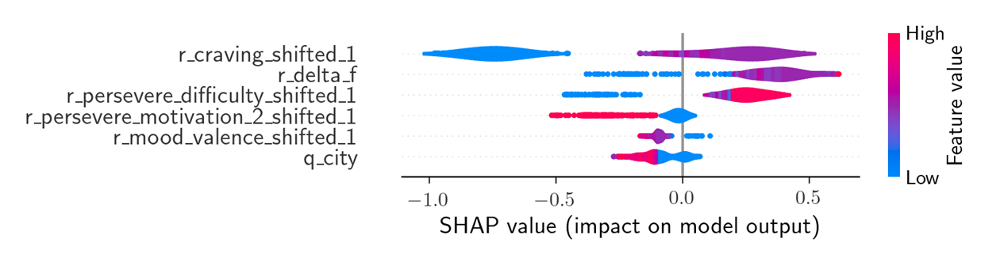

# Porn Addiction Relapse Prediction

This repository contains the data processing, machine learning, and model interpretation code about the prediction of relapses of self-diagnosed porn addicts that used a mobile app to track their addictions.
Please note that the used data is not public and is not part of the repository. 97% of the participants were male, so the sample size for the females was too small and we only considered the males.

This is a binary classification problem (*relapse*/*no relapse*). We are predicting relapse of pornography addiction based on previously answered questions about the app user's mental state and demographic information.
The idea is: can we predict if a user will relapse based on his previous answers?

## ML Pipeline

[The first script](01_preprocessing.ipynb) contains the pre-processing of the data and finds the relevant questionnaire answers for each indication of *relapse*/*no relapse*.

[The second script](02_ML-pipeline.ipynb) contains the machine learning pipeline.

Before we use the data to build the model, we select the data we want to use. Each app user can fill out the questionnaire for as many times as he wants.
In order to not have a too extreme overprepresentation of users with many entries, we set an upper limit to the number of entries per user.
Addditionally, we removed users from whom we only have very few entries - they might just have tested the app without actually using it properly.
We choose **users with at least 7 entries** and using **only up to 200 entries per user** - this yields **224 users with 9846 overall entires**.
This image show a histogram of the number of responses

The distribution of the target variable is
| target | entries (rate) |
| - | - |
| 0 (no relapse) | 8133 (84.6%) |
| 1 (relapse) | 1713 (17.4%) |

Based on the properties of the data, we make the following decisions for building the model:
* We are performing a **five-fold nested cross-validation** because of the rather small sample size.
* We are using scikit-learns **[StratifiedGroupKFold](https://scikit-learn.org/stable/modules/generated/sklearn.model_selection.StratifiedGroupKFold.html)** in order to make sure to put each user in either the train or the test set. Each userID is one group in StratifiedGroupKFold.
* We are **upsampling** the minority class with [SMOTE](https://imbalanced-learn.org/stable/references/generated/imblearn.over_sampling.SMOTE.html).
* Because of the data imbalance, we are using the (area under the) **precision-recall (PR) curve** as our evaluation metric.

The final pipeline then is:
* SMOTE for upsampling the minorty class (*relapse*)
* [MaxAbsScaler](https://scikit-learn.org/stable/modules/generated/sklearn.preprocessing.MaxAbsScaler.html) for scaling the features
* [LightGBM](https://github.com/microsoft/LightGBM) to build the model

## Results and Feature Importance with SHAP

[The third script](03_ML-results.ipynb) loads the five models found via hyperparameter tuning with the ML pipeline and generates evaluation and [SHAP](https://github.com/shap/shap) plots.

### Model Performance:

This plot shows the PR-curve for all five folds/models:

**Performance Result:**
This baseline describes a no-skill classifier, i.e., guessing the outcome based on the distribution of the data. Because of using each participant's data in either the training or test set, the baseline classifiers slightly differ (0.182, 0.174, 0.170, 0.171, 0.172). The model performances of each fold are all very similar (the lines in the figure are close to each other) which indicates that the trained models are robust. Overall, we observe that the performance of our models is better than the baseline, but not very high overall. To give an example for reading the precision-recall-curve: there is a threshold that returns a precision and a recall of about 0.4 for each model. This means that 40% of the cases classified as 'relapse' are actually relapses and 40% of all relapses were classified as 'relapse' by the model.

**Performance Discussion:**
The performance of the models is better than chance but not very good, so the model is not satisfyingly successful at predicting a relapse. One explanation is that these relapses are not better predictable and follow some randomness. Or the questionnaires did not cover some of the factors that contribute to porn addiction relapse. The prediction performances of our models are still better than chance, and looking into features importance can show us trends of what factors might indicate a future relapse. 

### Model Explanation:

We then look into the most predicitve features via SHAP. The six most important variables are:

| short name | meaning |
| ---------------------| -------------- |
| r_delta_f | Time passed since the last questionnaire was filled out |
| r_craving_shifted_1 | Answer on a scale from 1 (no urge) to 7 (overwhelming urge) to the question 'How strong is your urge to watch pornography at the moment?', rated in the last questionnaire |
|r_mood_valance_shifted_1 | Indicates how good the mood was in the last questionnaire |
| r_perservere_difficulty_shifted_1 | Indicates how strong the difficulty was to abstain in the last questionnaire |
| r_perservere_motivation_2_shifted_1 | Indicates that the participant chose 'I focused on what I like' as a motivation to abstain in the last questionnaire |
| q_city | Indicates the size of the city, with three possible values from small to large size city (populations of up to 100000, between 100000 and 500000, over 500000) |

These plots show the SHAP feature importance for each of the five models:

**Feature Importance Results:**
While the importance ranking of the features was slightly different between the folds, overall, the same features were the most important in each fold, indicating a robust model. The feature values are shown in a color-coded way, with blue indicating a low value and red indicating a high value. The SHAP-value (y-axis) shows the impact on model output. The higher the SHAP value, the more likely is the prediction of class 1, i.e., *relapse*. The lower the SHAP-value, the more likely is the prediction of 0, i.e., *no relapse*.

For `r_craving_shifted_1`, we observe the trend that a lower feature value, i.e., lower reported craving of porn consumption, contributes to the model prediction *no relapse*; and vice versa. For `r_delta_f`, we observe that higher feature values, i.e., longer times since the last micro-survey was filled out, contribute to predicting a *relapse*. For `r_mood_valance_shifted_1`, we observe a small effect of higher values, i.e., better mood contributing to predicting *no relapse*. For `r_preservere_difficulty_shifted_1`, we observe that higher values, i.e., higher reported difficulty to abstain from pornography use, contributes to predicting *relapse*. For `r_perservere_motivation_2_shifted_1`, focusing on what the participants likes, e.g., hobbies, contributes to predicting *no relapse*. For `q_city`, we observe that higher feature values, i.e., living in a larger city, contribute to predicting *no relapse*. 
These results will be discussed by our collaborators who are experts in the field of addictions.
